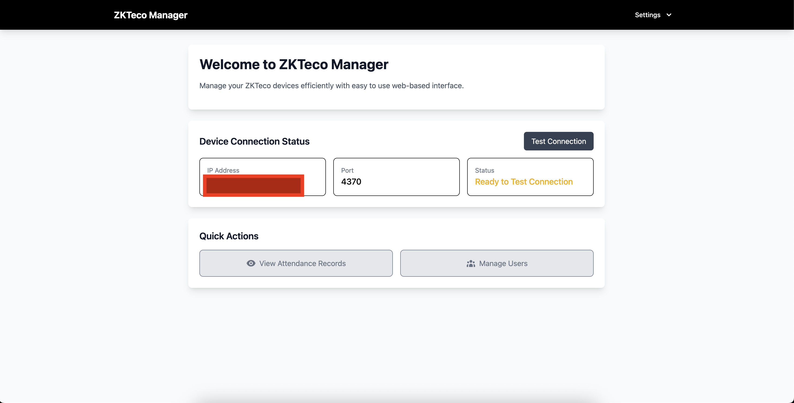
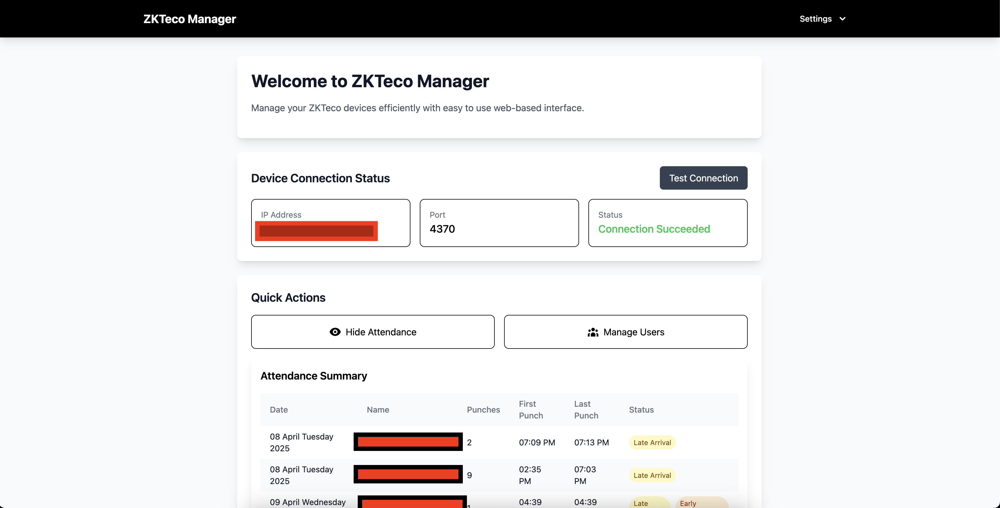

# ZKTeco Web Manager (WIP)

A full-stack web application for managing ZKTeco devices with a FastAPI backend and React frontend.

## Special Thanks

This project heavily relies on the amazing [pyzk](https://github.com/fananimi/pyzk) library by [@fananimi](https://github.com/fananimi). Without this library, this project wouldn't be possible. Please consider:

- ⭐ Starring the [pyzk repository](https://github.com/fananimi/pyzk)
- Contributing to pyzk if you can
- Supporting the maintainer's work

## Docker release 🌐
Docker release will allow you to run the app on your own infastructure.
```bash
docker pull ghcr.io/ar-nadeem/zkteco-web-manager:prod-latest
```
```bash
docker run -p 8000:8000 ghcr.io/ar-nadeem/zkteco-web-manager:prod-latest
```
Since we serve frontend via fastapi. Just map port `8000` to any port `8000:80` and the whole app will be live there.
The envoirement variable is already configured in the github actions to point to `window.location.origin` for seamless working of the app.

## Working on Next
- Better frontend user experience
- More fine grained controlled
- Bug fixes

## Bug
- Editing user will delete their fingerprint.


## Screenshots

Here are some screenshots of the application in action:





## Features

- Web-based management interface for ZKTeco devices :white_check_mark:
- FastAPI backend for efficient API handling :white_check_mark:
- React frontend for modern and responsive UI
- Device management capabilities
- Data synchronization with ZKTeco devices
- More coming soon

## Prerequisites

- Python 3.11+
- Node.js (Typescript) and npm/bun
- ZKTeco device(s) on the network

## Installation

## Configuration
Just make sure .env exists in frontend folder.
.env file should contain the backend link 
If runing through FastAPI
```bash
VITE_API_BASE_URL=`${window.location.origin}`
```
If runing seperately
```bash
VITE_API_BASE_URL=http://localhost:8000
```

### App Setup for local testing (Backend - Serve frontend using FastAPI)

1. Create a virtual environment:

   ```bash
   python -m venv venv
   source venv/bin/activate  # On Windows: venv\Scripts\activate
   ```

2. Install Python dependencies:
   ```bash
   pip install -r backend/requirements.txt
   ```

3. Run build script
```bash
./build.sh
```

4. Run Devlopment server
```bash
fastapi dev
```

### Frontend Setup (For testing or contributing to frontend)

1. Navigate to the frontend directory:

   ```bash
   cd frontend
   ```

2. Install Node.js dependencies:
   ```bash
   npm install
   # or
   bun install
   ```
3. Run backend and frontend togather
```
fastapi dev
bun run dev
```

```
The API will be available at `http://localhost:8000`
```


### Frontend Structure

The frontend directory is organized as follows:

```
frontend/
├── src/                    # Source code directory
│   ├── components/         # Reusable React components
│   ├── types/             # TypeScript type definitions
│   ├── apiHandler/        # API integration and services
│   ├── assets/            # Static assets (images, fonts, etc.)
│   ├── App.tsx            # Main application component
│   └── main.tsx          # Application entry point
├── public/                # Public static files
├── index.html            # HTML entry point
├── vite.config.ts        # Vite configuration
├── tsconfig.json         # TypeScript configuration
├── tailwind.config.js    # Tailwind CSS configuration
└── package.json          # Project dependencies and scripts
```


## API Documentation

Once the backend is running, you can access:

- Interactive API documentation at `http://localhost:8000/docs`
- Alternative API documentation at `http://localhost:8000/redoc`

## Contributing

1. Fork the repository
2. Create a new branch for your feature
3. Commit your changes
4. Push to your branch
5. Create a Pull Request

## Support

For support, please open an issue in the GitHub repository.
