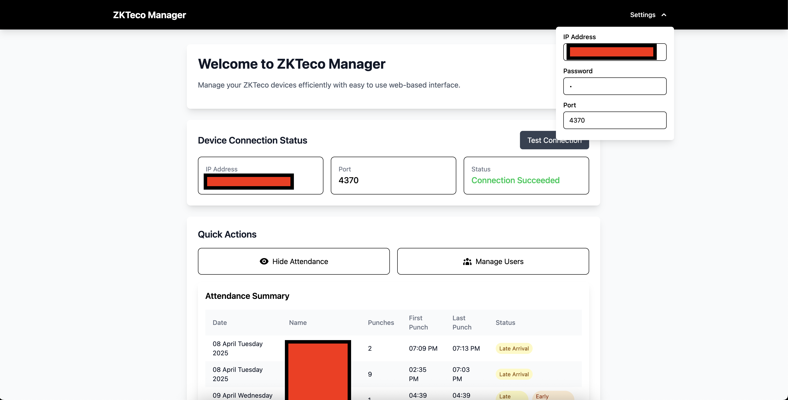

# ZKTeco Web Manager (WIP)

A full-stack web application for managing ZKTeco devices with a FastAPI backend and React frontend.

## Working on Next

- Users
- Better frontend user experience
- More fine grained controlled

## Screenshots

Here are some screenshots of the application in action:




## Features

- Web-based management interface for ZKTeco devices :white_check_mark:
- FastAPI backend for efficient API handling :white_check_mark:
- React frontend for modern and responsive UI
- Device management capabilities
- Data synchronization with ZKTeco devices
- More coming soon

## Prerequisites

- Python 3.7+
- Node.js (Typescript) and npm/bun
- ZKTeco device(s) on the network

## Installation

### Backend Setup

1. Create a virtual environment:

   ```bash
   python -m venv venv
   source venv/bin/activate  # On Windows: venv\Scripts\activate
   ```

2. Install Python dependencies:
   ```bash
   pip install -r requirements.txt
   ```

### Frontend Setup

1. Navigate to the frontend directory:

   ```bash
   cd frontend
   ```

2. Install Node.js dependencies:
   ```bash
   npm install
   # or
   bun install
   ```

### Frontend Structure

The frontend directory is organized as follows:

```
frontend/
├── src/                    # Source code directory
│   ├── components/         # Reusable React components
│   ├── types/             # TypeScript type definitions
│   ├── apiHandler/        # API integration and services
│   ├── assets/            # Static assets (images, fonts, etc.)
│   ├── App.tsx            # Main application component
│   └── main.tsx          # Application entry point
├── public/                # Public static files
├── index.html            # HTML entry point
├── vite.config.ts        # Vite configuration
├── tsconfig.json         # TypeScript configuration
├── tailwind.config.js    # Tailwind CSS configuration
└── package.json          # Project dependencies and scripts
```

## Configuration
None needed. Just make sure .env exists in frontend folder.

## Running the Application

### Backend

1. Activate the virtual environment if not already activated
2. cd into backend folder.
3. Run the FastAPI server:
   ```bash
   fastapi run
   ```
   The API will be available at `http://localhost:8000`

### Frontend

1. In a separate terminal, cd to the frontend directory
2. Start the development server:
   ```bash
   npm run dev
   # or
   bun run dev
   ```
   The frontend will be available at `http://localhost:3000`

## API Documentation

Once the backend is running, you can access:

- Interactive API documentation at `http://localhost:8000/docs`
- Alternative API documentation at `http://localhost:8000/redoc`

## Contributing

1. Fork the repository
2. Create a new branch for your feature
3. Commit your changes
4. Push to your branch
5. Create a Pull Request

## Support

For support, please open an issue in the GitHub repository.
